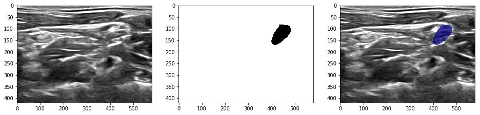
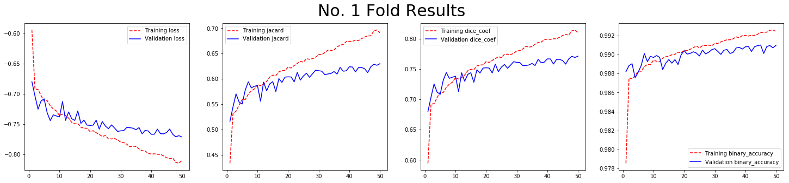
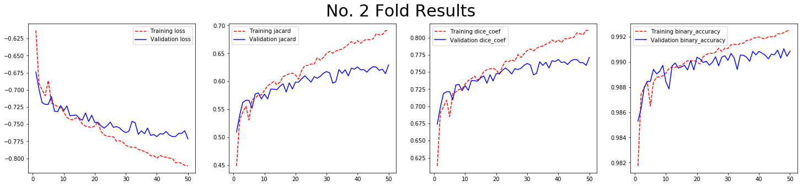
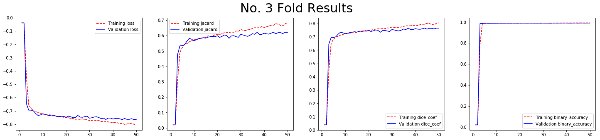
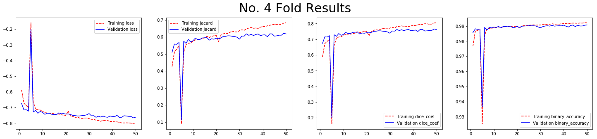
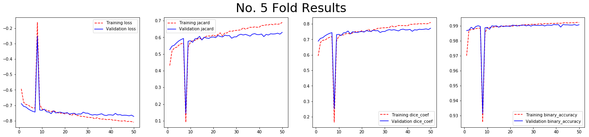

# Submission to Ultrasound Nerve Segmentation Kaggle

This repo contatns my submission to Kaggle Competition [Ultrasound Nerve Segmentation](https://www.kaggle.com/c/ultrasound-nerve-segmentation). It achieves a mean dice coefficient of ```0.64785``` on the private leaderboard.

## Dataset

The training images are read in grayscale and augumented with ```rotation```, ```width_shift```, ```height_shift```, ```shear```, ```zoom``` and ```horizontal_flip```.



## Model

I use a ```VGG16``` + ```U-Net``` architecture for the segmentation. I train it with ```Adam``` optimizer with learning rate ```5e-5```.

## Training

The model is trained with 5-fold cross-validation. The fold specific performance is observed as below.







## Evaluation

Mean Dice Coefficient is used as evaluation metric.

Public Leaderboard Score: ```0.65853```

Private Leaderboard Score: ```0.64785```
